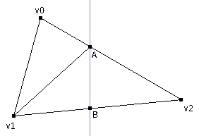

# gpu 1: Software rasterizer, part 2

In our quest to experience the difficulties of the graphics pipeline, we have so far made a rasterizer which can draw a square and a triangle.

<canvas id="c0" width="128" height="128">A javascript canvas.</canvas>
<script src="gpu1_0.js"></script>

This is not very useful, so we will make its missing parts and hopefully render a complex scene with it. (My definition of complex is something like a textured cube at this point.)

## Clipping

The vertex processing part is not doing any clipping right now. That means it will just blow up trying to render the external triangle in [Simon Yeung's post](http://simonstechblog.blogspot.com/2012/04/software-rasterizer-part-1.html). That is a triangle with one vertex behind the camera. Let's give it a try:

<canvas id="c1" width="128" height="128">A javascript canvas.</canvas>
<script src="gpu1_1.js"></script>

Here goes nothing... It's because the rasterizer expects a counter-clockwise triangle. When the vertex behind the camera gets transformed, it re-enters the viewport through the top and reverses the triangle direction, so it blows up.

This is solved by clipping triangles against the near plane. We are supposed to clip against all faces of the viewing volume, but the rasterizer already does it for the X and Y planes and it should be safe to ignore the far plane for now.

We should also reject points where `w = 0`, but such a point [only occurs](https://community.khronos.org/t/some-clarification-about-clipping/74041/7) when someone tries to set near plane distance to 0. I trust the only user of this program, myself, to not do that.

Checking for points inside the near plane is equivalent to just checking for `z > 0` in clip space (`z > -1` in OpenGL). We don't need to do anything if the triangle is fully in or fully out of the `z > 0` plane. If the triangle is partially inside, we need to compute two intersection points and form 1 or 2 new triangles using those as vertices.



To compute the intersection points, we write edges as parametric equations between two vertices, take the dot product with the vector describing the plane equation and find where the product equals to 0. In our case that dot product boils down to only the `z` coordinate.

(If we were clipping against the far plane, it would boil down to `z - w`, because the far plane is described by `z < w` in clip space. Same applies to X and Y planes.)

~~~
\begin{align*}
P(t) &= P_0 + t(P_1 - P_0)\\
P(t) \cdot B &= (P_0 + t(P_1 - P_0)) \cdot B\\
0 &= z_0 + t(z_1 - z_0)\\
t &= \frac{z_0}{z_0 - z_1}\\
\end{align*}
~~~

Here is a function which implements all this:

```
function clip_trig(t){
    var v0 = t.v0, v1 = t.v1, v2 = t.v2;
    var tmp;
    if(v0[2] < 0 && v1[2] < 0 && v2[2] < 0)
        return [];
    if(v0[2] >= 0 && v1[2] >= 0 && v2[2] >= 0){
        return [t];
    }
    if(v0[2] * v2[2] > 0){
        tmp = v1; v1 = v2; v2 = tmp;
        tmp = v0; v0 = v1; v1 = tmp;
    }else if (v1[2] * v2[2] > 0){
        tmp = v0; v0 = v2; v2 = tmp;
        tmp = v0; v0 = v1; v1 = tmp;
    }
    var t02 = v0[2] / (v0[2] - v2[2]);
    var t12 = v1[2] / (v1[2] - v2[2]);
    var a = add_vec(v0, scale_vec(t02, sub_vec(v2, v0)));
    var b = add_vec(v1, scale_vec(t12, sub_vec(v2, v1)));
    if(v2[2] < 0){
        return [
            {v0: v0, v1: v1, v2: a},
            {v0: v1, v1: b, v2: a}
        ];
    }else{
        return [{v0: a, v1: b, v2: v2}];
    }
}
```

We simplify the code a lot by swapping vertices to put a certain vertex in one side of the plane (`v2` in our case) and others in the other side. This way of clipping triangles is described in section 12.4.3 of [this book](https://www.amazon.com/Fundamentals-Computer-Graphics-Steve-Marschner/dp/1482229390).

<canvas id="c2" width="128" height="128">A javascript canvas.</canvas>
<script src="gpu1_2.js"></script>

And, thanks to near-plane clipping, we can now draw objects with vertices behind the camera. Yay!

## Depth buffering

Now we can continue towards that precious textured cube. Currently our problem is with the "cube" part. Since we don't have a depth buffer, we don't know which side of the cube to draw on the screen.

<canvas id="c3" width="128" height="128">A javascript canvas.</canvas>
<script src="gpu1_3.js"></script>

This brings us to our first pixel value we need to get by interpolation from vertices: `z`. As explained in Simon Yeung's [second post](http://simonstechblog.blogspot.com/2012/04/software-rasterizer-part-2.html), view space `z` is not an affine function of screen space _X_ and _Y_, but view space `1/z` is. Furthermore, screen space _Z_ is an affine function of view space `1/z`, so it can be interpolated and used in place of `1/z`.

We do the interpolation using the [barycentric coordinates](https://fgiesen.wordpress.com/2013/02/06/the-barycentric-conspirac/) already computed as edge functions.

```
function draw_trig(v0, v1, v2, color){
    /* ... */
            if(w0 >= 0 && w1 >= 0 && w2 >= 0){
                var X = x >> 8;
                var Y = y >> 8;
                var k = 1 / (w0 + w1 + w2);
                var Z = v0[2]*w0*k + v1[2]*w1*k + v2[2]*w2*k;
                if(!Z_buffer[X][Y] || Z_buffer[X][Y] > Z){
                    put_pixel(X, Y, color);
                    Z_buffer[X][Y] = Z;
                }
            }
    /* ... */
}
```

Here's a proper cube:

<canvas id="c4" width="128" height="128">A javascript canvas.</canvas>
<script src="gpu1_4.js"></script>

## Texture interpolation

We were really lucky about _Z_ varying linearly with _X_ and _Y_ over the triangle. That isn't the case for other vertex attributes like texture `u` and `v` coordinates. It's because they don't pass through the perspective transform.

So, we have to somehow find the ~$\frac{1}{w}$~(= ~$\frac{1}{-z}$~) factor used to get the other coordinates and apply them to the vertex attributes to be able to interpolate them on the screen space triangle. (See chapter 11.2.4 of [this book](https://www.amazon.com/Fundamentals-Computer-Graphics-Steve-Marschner/dp/1482229390) for an explanation with better math.)

How OpenGL accomplishes this is [apparently](https://stackoverflow.com/a/24460895) to store ~$\frac{1}{w}$~ in the `w` field after perspective division. That makes sense — after perspective division, the `w = 1` field in the vector serves no purpose other than being mathematically correct. We can just store ~$\frac{1}{w}$~ there.

Since we can only interpolate ~$\frac{u}{w}$~ and ~$\frac{v}{w}$~ over the triangle, those values can be computed during perspective division and passed to the rasterizer. I just added them as 5th and 6th coordinates of vertices. That is a hack, but JS is kinda awkward when passing around structured numeric data...

The rasterizer computes ~$\frac{1}{w}$~, ~$\frac{u}{w}$~ and ~$\frac{v}{w}$~ for every pixel and gets texture `u` and `v` coordinates from them. ~$\frac{1}{w}$~ is also a depth value and can be used in Z buffering:

```
function draw_trig(v0, v1, v2, n, color){
    /* compute lighting once */
    var L = dot_vec(light, n);

    /* ... */
            if(w0 >= 0 && w1 >= 0 && w2 >= 0){
                var k = 1 / (w0 + w1 + w2);
                /* interpolate 1/w, u/w and v/w */
                var wr = v0[3]*w0*k + v1[3]*w1*k + v2[3]*w2*k;
                var uw = v0[4]*w0*k + v1[4]*w1*k + v2[4]*w2*k;
                var vw = v0[5]*w0*k + v1[5]*w1*k + v2[5]*w2*k;
                var u = uw / wr;
                var v = vw / wr;
                if(!Z_buffer[x][y] || Z_buffer[x][y] < wr){
                    put_pixel(x, y, u, v, L, color);
                    Z_buffer[x][y] = wr;
                }
            }
    /* ... */
}
```

I thought it was a good time to throw in some rudimentary ~$(\vec{n}\cdot\vec{L})$~ lighting. Here is the majestic textured box:

<canvas id="c5" width="128" height="128">A javascript canvas.</canvas>
<script src="gpu1_5.js"></script>

## Teapot

I think adding more features to this rasterizer would start to move it out from the _"Learning how to draw with a CPU"_ region and into the _"inventing pretty images in my backyard"_ region. Furthermore, I vaguely remember that the original reason for adding stuff to this program was to be able to follow the techniques in [Optimizing the basic rasterizer](https://fgiesen.wordpress.com/2013/02/10/optimizing-the-basic-rasterizer/) which, in turn, can help when trying to implement all this in hardware.

Yeah, so, optimization. What I have in mind is a spinning teapot to put a load on the renderer and a FPS counter for measurements. It would be also good to add a start/stop button so this page does not become a canvas bomb.

I added the UI elements and packed the scene setup code into a function.

```
function render(t){
    var phi = t * 360 / 2000; /* 0.5 Hz */
    var M = matmul(trs(0, -1.5, -6), rot(phi, 0, 1, 0));

    /* model to world, recompute normals */
    var verts_world = [];
    for(var i=0; i<verts.length; i++){
        verts_world.push(mat4x4_mul_vec4(M, verts[i]));
    }
    for(var i=0; i<trigs.length; i++){
        var t = trigs[i];
        var v0 = verts_world[t[0]];
        var v1 = verts_world[t[1]];
        var v2 = verts_world[t[2]];
        var n = norm_vec(cross_vec(sub_vec(v1, v0), sub_vec(v2, v0)));
        trigs[i][3] = n;
    }

    /* world to clip */
    var verts_clip = [];
    for(var i=0; i<verts_world.length; i++){
        verts_clip.push(mat4x4_mul_vec4(P, verts_world[i]));
    }
    /* skipped clipping for now */
    /* clip to viewport */
    var verts_vp = [];
    for(var i=0; i<verts_clip.length; i++){
        verts_vp.push(viewport(wnorm(verts_clip[i]), W, H));
    }

    /* rasterize */
    for(i=0; i<W; i++){
        Z_buffer[i] = [];
    }
    for(var i=0; i<trigs.length; i++){
        var t = trigs[i];
        draw_trig(verts_vp[t[0]], verts_vp[t[1]], verts_vp[t[2]], t[3]);
    }
}
```

Here is the spinning teapot:

<canvas id="c6" width="128" height="128">A javascript canvas.</canvas>
<script src="teapot.js"></script>
<script src="gpu1_6.js"></script>

It can currently render on a 128x128 canvas at 20fps on my modest i3-3217U. Not the fastest renderer around, but, well, at least it isn't choking the browser tab. In the next post we will work on optimizing this thing. See you until then!
