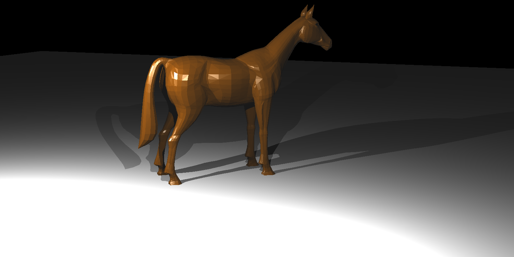
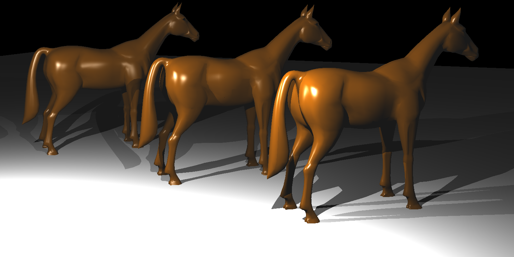
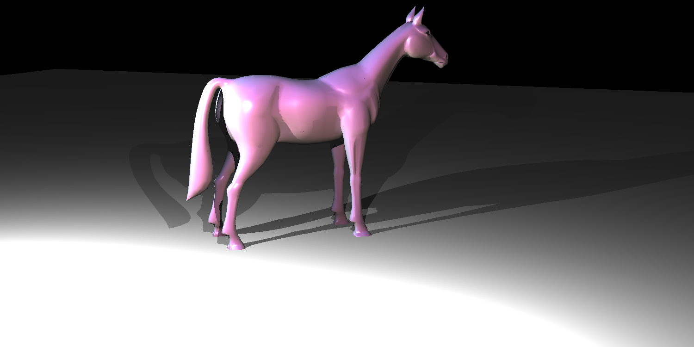

# rt 2: Transformations, smooth shading

This one is about transforming objects and interpolating vertex normals.

The horse scene had 11000 triangles with 1500x750 resolution. Seeing the bunny taking 94 seconds to render, with a rough extrapolation I thought the horse would take ~1000 seconds. Nope, too long for feedback. Even for lower resolutions.

Implementing a BVH was not in my plans, I was too lazy to partition stuff to pthreads and OpenMP created problems with clang.

So, for optimization I rewrote vector/matrix ops in SSE4 and changed the triangle intersection [algorithm][alg]. After some `callgrind`ing I could take bunny down to 20 seconds. This would make horse 4-5 minutes.

It ended up taking 550 seconds. Maybe I didn't account for the two point lights.

The transformations were mostly textbook material. What got me thinking was how to compute the vertex normals. After some mindgarble about 2d arrays and hashmaps, I ended up maintaining a huge vec4 array and adding up surface normals as the triangles are precomputed. After normalizing the whole array, triangles could look up their respective vertex normals from indices.

rendering time: 0.162s

rendering time: 0.342s

To implement mesh instancing I just copied over triangles. I have to worry about rendertime before worrying about memory.

this took ~2700 seconds with 33000 objects in the scene.

I saw someone in the class using surface normals as diffuse reflectance of the object. Thought it was cool, modified it a bit with magenta, red and blue components instead of RGB.

Not your [Princess Celestia][celestia], but it has its own vibe.

Rendering times are on a single core of the [i3-3217U][cpu-bmark].

[celestia]: http://mlp.wikia.com/wiki/Princess_Celestia
[cpu-bmark]: https://www.cpubenchmark.net/cpu.php?cpu=Intel+Core+i3-3217U+%40+1.80GHz
[alg]: http://ieeexplore.ieee.org/document/5159346/
