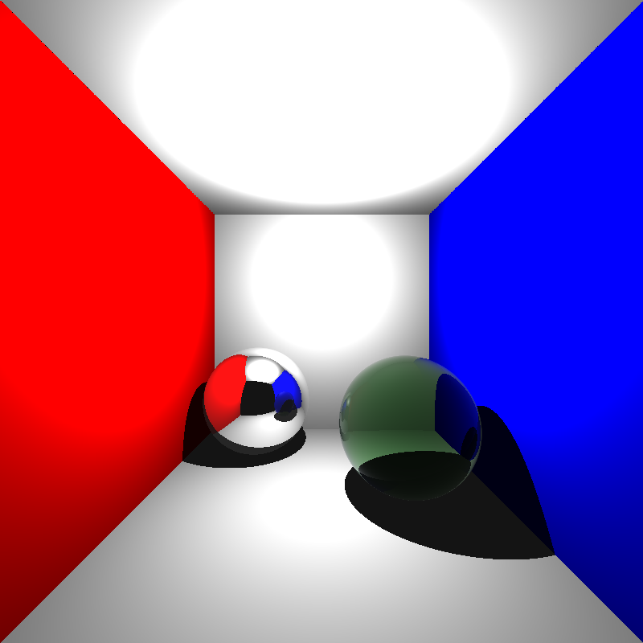
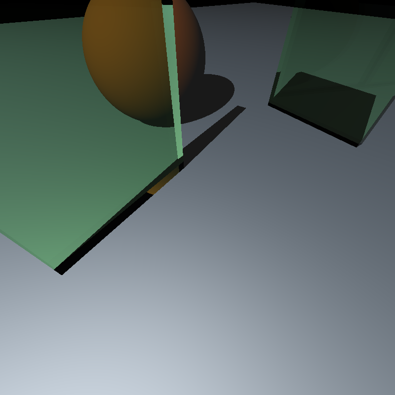
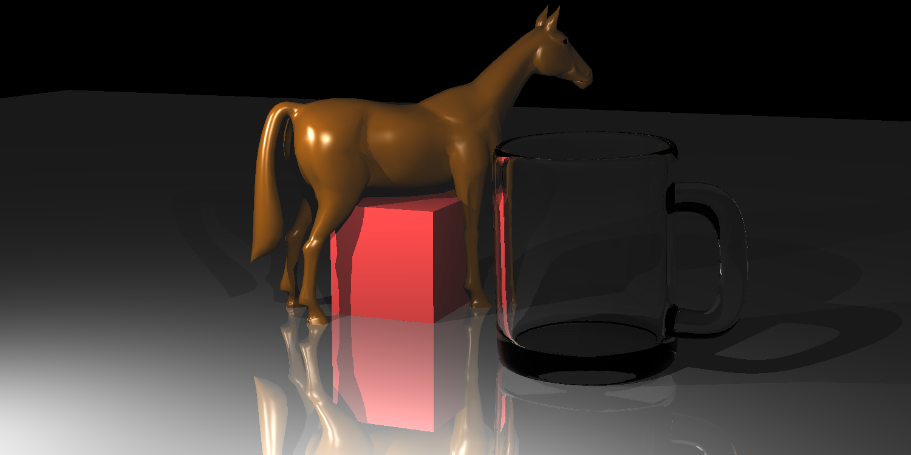
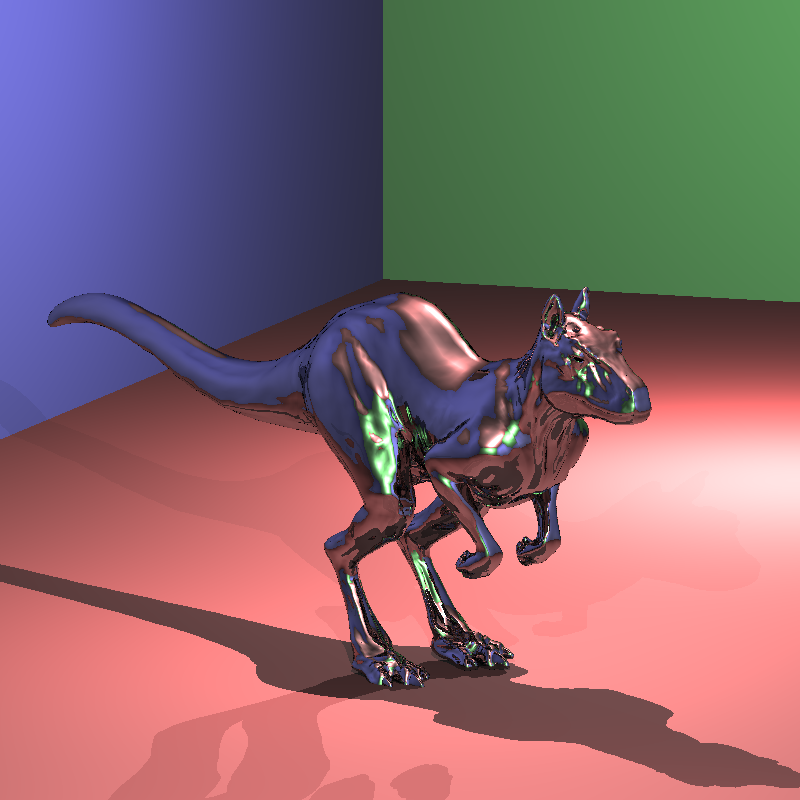
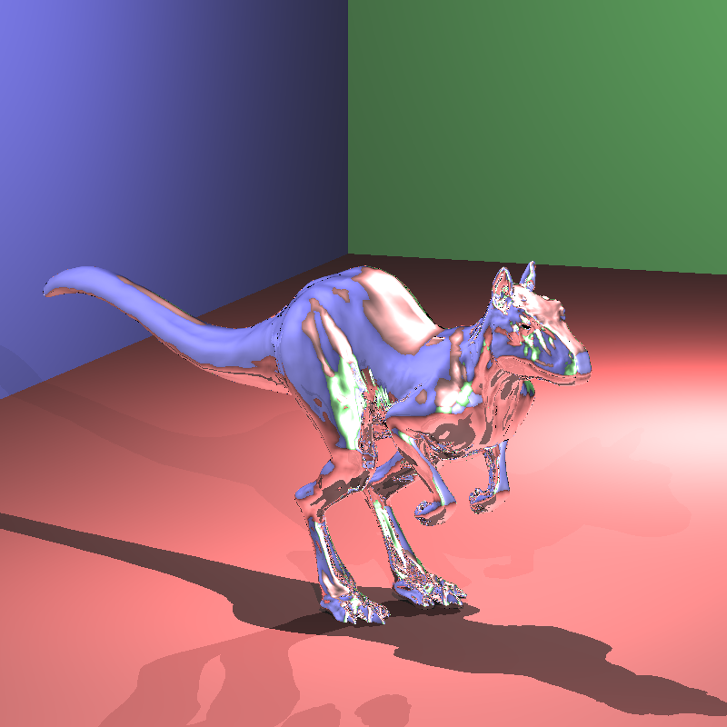
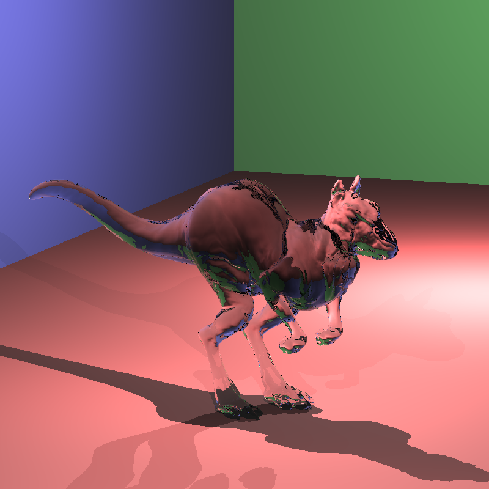

# rt 4: Recursive ray tracing

At some point we were going to get past simple Blinn-Phong shading.

rt 4 implements reflection, refraction, [Beer's law][beer] and [Schlick's approximation][schlick] so we can have transparent dielectric and conducting materials.

0.62s

A metal ball with reflectance <0.9 0.9 0.9> and a glass ball with η = 1.05. Note the reflection on the side of glass ball- an effect of [Fresnel reflection][fresnel].

2.80s

Two glass plates and a ball.

32.88s

Horse, cube and glass mug. Implementing a [SAH][sah] on the BVH seemed to help here. Maximum recursion depth is 6 which enables up to 26 auxiliary rays per camera ray.

4.13s

4.22s

Conductive killeroo models, first with reflectance 0.5, then with 1.

18.27s

Glass killeroo, interesting refraction patterns. η = 1.1.

Rendering times are on a [i3-3217U][cpu-bmark].

Compiled with clang-5.0 on [DragonFly BSD][dfly].

[cpu-bmark]: https://www.cpubenchmark.net/cpu.php?cpu=Intel+Core+i3-3217U+%40+1.80GHz
[dfly]: http://www.dragonflybsd.org
[beer]: https://en.wikipedia.org/wiki/Beer%E2%80%93Lambert_law
[schlick]: https://en.wikipedia.org/wiki/Schlick%27s_approximation
[fresnel]: https://en.wikipedia.org/wiki/Fresnel_equations
[sah]: http://www.cs.uu.nl/docs/vakken/magr/2015-2016/slides/lecture%2003%20-%20the%20perfect%20BVH.pdf
