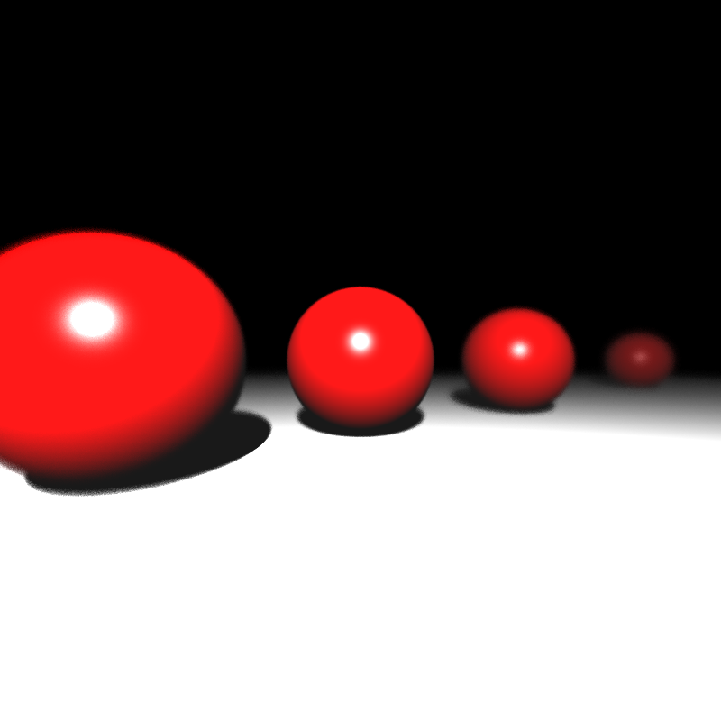
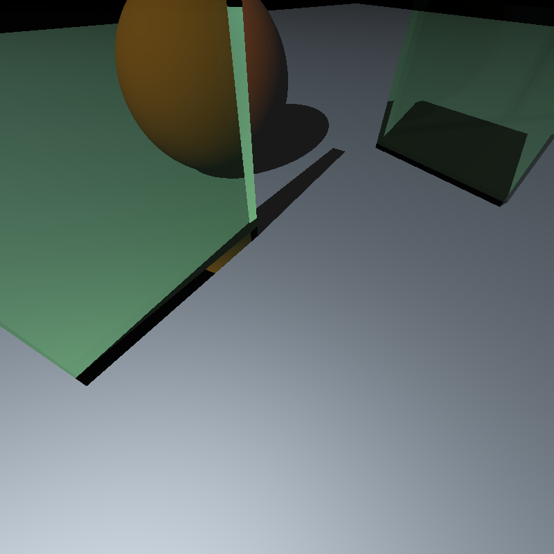
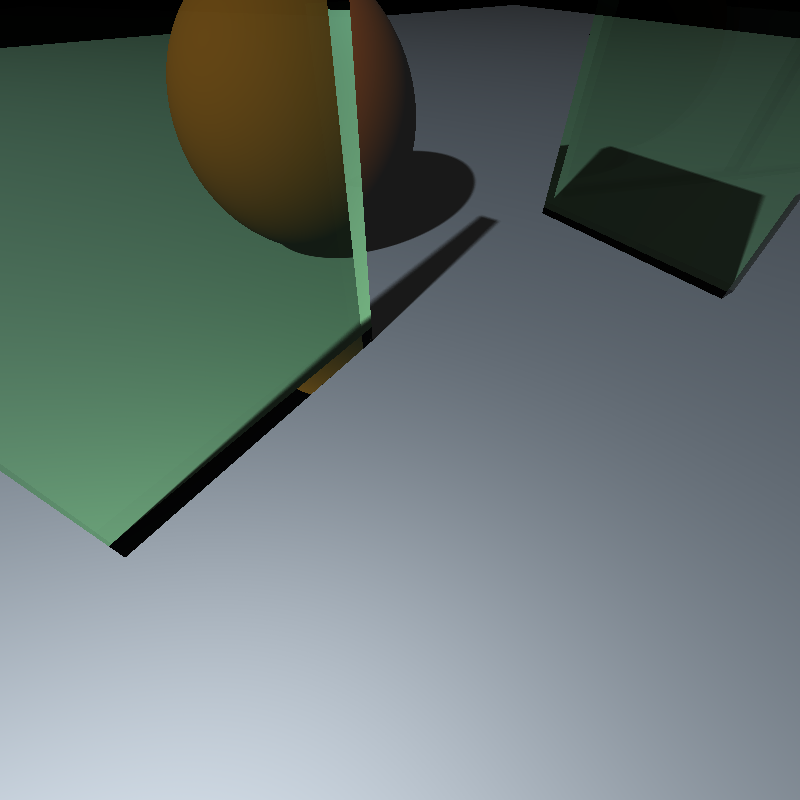
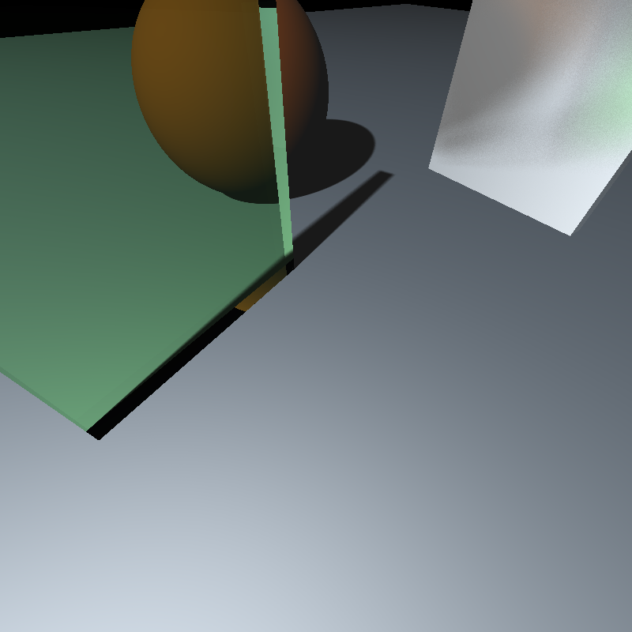
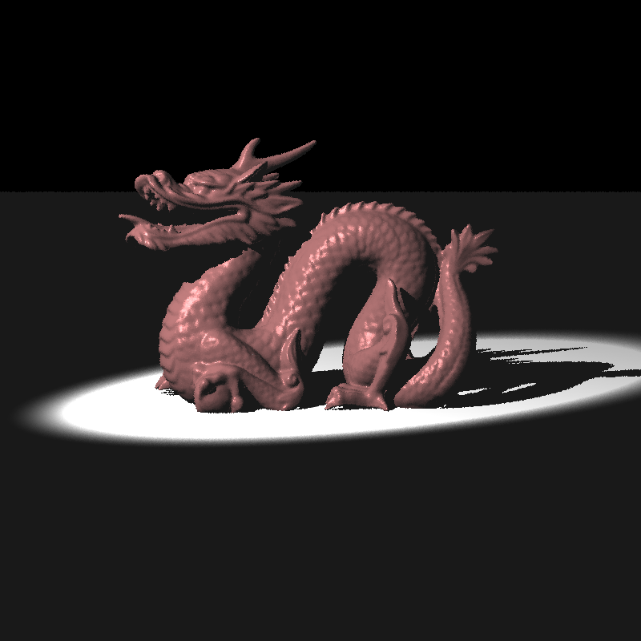

# rt 5: Distribution ray tracing, spotlights

This one is about implementing parts of the famous [article][cook84] of Robert Cook.

We apply supersampling over many intervals to get different effects like depth of field, gloss reflections and soft shadows.

15.91s

[Depth of field][depth] effect. We average many rays sent from an [aperture][aperture] to a focal point, resulting in objects further away from the plane of focus to appear blurry.

97.15s

104.47s

The same scene, first illuminated by a point light, second by an area light. [Penumbra][penumbra] resulting from the area light can be seen in the second picture. We average many rays sent towards the area light to create the soft shadow.

82s

A glossy metal plate. The gloss is achieved by scattering many rays through a cone instead of one reflection ray.

rt 5 also has spot lights which only illuminate a cone towards a given direction.

80.47s

141.13s

My metallic dragon was given as an assignment :D The first dragon was constructed with one sample per pixel while in the second the average of 100 rays is taken. The difference is easy to spot- look at the heads of dragons.

Rendering times are on a [i3-3217U][cpu-bmark].

Compiled with clang-5.0 on [DragonFly BSD][dfly].

[cpu-bmark]: https://www.cpubenchmark.net/cpu.php?cpu=Intel+Core+i3-3217U+%40+1.80GHz
[dfly]: http://www.dragonflybsd.org
[cook84]: http://artis.inrialpes.fr/Enseignement/TRSA/CookDistributed84.pdf
[depth]: https://en.wikipedia.org/wiki/Depth_of_field
[aperture]: https://en.wikipedia.org/wiki/Aperture
[penumbra]: https://en.wikipedia.org/wiki/Umbra,_penumbra_and_antumbra
